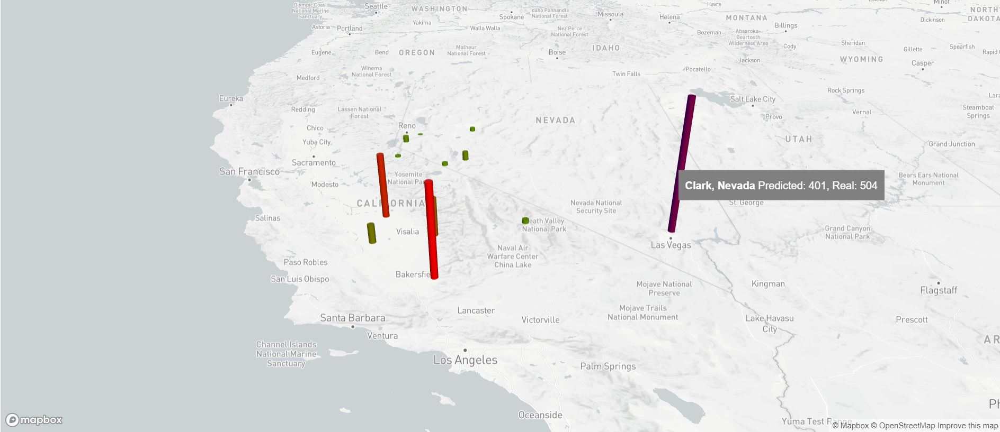
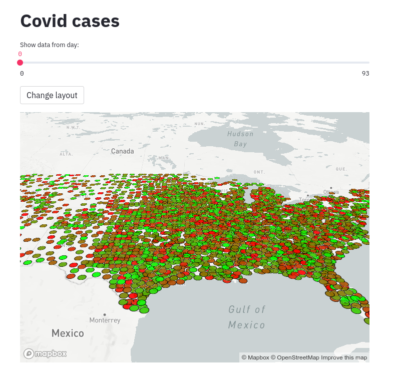
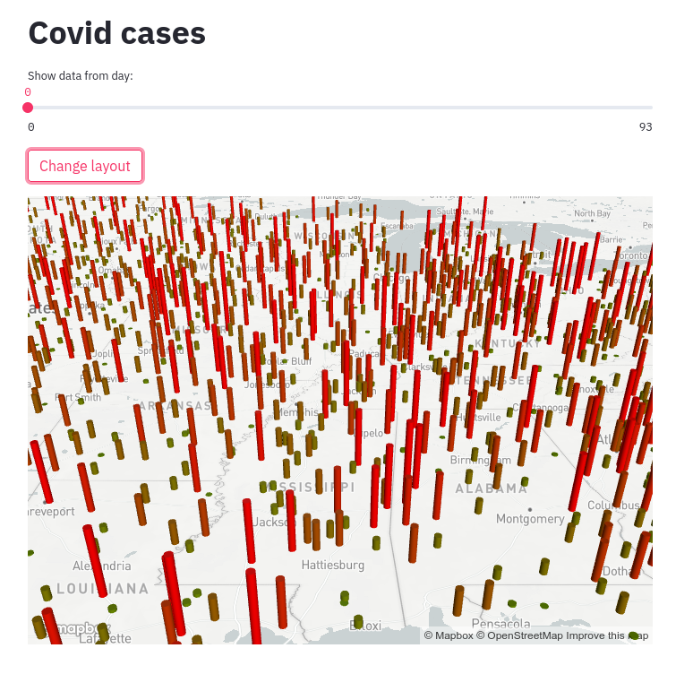

# Michał Belniak, Paweł Młyniec
Prediction of COVID-19 cases using Spatio-Temporal Graph Convolutional Networks.

## Instalation
After clone, create conda env
```
$ conda env create -f environment.yml
$ conda activate zzsn-mlyniec-belniak
```
Install all required packages.
```
pip install -r requirements.txt
```
Configure environment after account creation on wandb.ai. In `.env` file: 
```
DATA_DIR=datasets
RESULTS_DIR=results
WANDB_ENTITY=WANDB_LOGIN
WANDB_PROJECT=WANDB_PROJECT_NAME
```
If you want to run experiments without wandb support, add to `.env`:
```
WANDB_MODE=dryrun
```

## Run experiments
Standard main execution (Covid-19 for 20 epochs):
```
$ python -m zzsn2021.main
```

If you want to disable CUDA:

```
$ python -m zzsn2021.main lightning.gpus=0
```

Change single configs:
```
$ python -m zzsn2021.main lightning.max_epochs=150 experiment.batch_size=64
```

Change run mode (available: 'debug', 'tune', 'view' or None):
```
$ RUN_MODE=debug python -m zzsn2021.main
```
(On Windows you can put 'RUN_NAME=<mode>' in the `.env` file)

To visualize data set RUN_MODE=view and VIEW_RUN_NAME=<run_name from which to take the trained model>, specify checkpoint path in experiment config to load trained model
```
RUN_MODE=view python -m zzsn2021.main experiment.resume_checkpoint=checkpoints/epoch_19.ckpt [ARGUMENTS]
```
The path to your model is `results/<wandb-project-name>/VIEW_RUN_NAME/<experiment.resume_checkpoint>`.
Then depending on your conda path streamlit hint will display in terminal.
Example streamlit run commend, which will open visualization on localhost:
```
streamlit run [path to main file]/main.py [ARGUMENTS]
```





## Misc
* Documentation in polish is in `docs` folder
* Project template from https://github.com/2021L-ZZSN/template/


